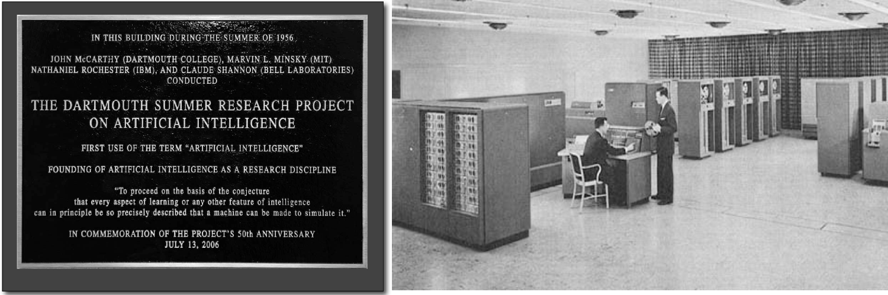

|ReAct|: An Interactive Educational Tool for AI Planning in Robotics
====================================================================

:Author: Presenters: Jack Rosenthal, Nhan Tran, Haoxaun Yang
:Date: 2018-03-01

.. |ReAct| raw:: latex

    \textsc{ReAct!}

.. default-role:: math

Background
----------

History
~~~~~~~

   The birth of Artificial Intelligence

History
~~~~~~~

.. beamer-columnset::

    .. beamer-column::
       :width: 0.7

       * AI Planning concepts (e.g., hybrid planning) are still new to the
         robotics field due to recent incresing interest in service robotics
         application.
       * Unfamiliar to various robotics researchers/students who rarely have
         interdisciplinary backgrounds.

    .. beamer-column::
       :width: 0.3

       .. figure:: graphics/robot.jpg
          :width: 120pt

Challenge in Robotics Education
~~~~~~~~~~~~~~~~~~~~~~~~~~~~~~~

* Robotics education curricula are being modified to include AI planning topics.
* Cognitive Robotics Course (Dr. Esra Erdem at Sabanci University)

  * Give robotics/software agents with higher-level cognitive function + reasoning
  * e.g., goals, perception, actions, mental states of other agents

* Challenge: Teaching diverse students

  * AI Planning and Reasoning
  * Change in dynamic environment
  * Background knowledge of low level control robots

Problem Description
-------------------

Problem Statement
~~~~~~~~~~~~~~~~~
* Teaching AI planning concepts to a group of students with heterogeneous background is challenging and time consuming. 
* Cognitive robotics course should teach students fundamental AI planning concepts (e.g. hybrid planning) and how to apply them rather than going into implementation details. 
* Create an interactive and educational tool to better teach students.

Related Works
-------------

Related Works
~~~~~~~~~~~~~

* Authors found "no related work that emphasizes the use of AI concept and
  state-of-the art technologies for cognitive robotics *education*"

.. admonition:: Personal Opinion

    If you remove the *education* restriction from your search, you find
    plenty of software systems, some of even which have been used in
    education.

    **Example, here at CSM:** Tom Williams uses the ADE system in his L-HRI
    course which can accomplish similar tasks [#]_

.. [#] Albeit, it requires you to use Java. Bleh.

Representation Languages
~~~~~~~~~~~~~~~~~~~~~~~~

* AI planning is a reasoning task: a robotic agent should be able to
  autonomously find a sequence of actions to execute in order to reach a given
  goal from its initial state.
* Requires representing the agent's actions in some logic-based formal
  representation language.

.. admonition:: Example

    Consider a robot who can only pick up and place boxes, and move.

    * The action of going to `y` can be described by the preconditions: the
      robot is not at `y`
    * This produces the ramifications: if the robot is holding a box `b`, and
      the robot goes to location `y`, then `b` goes to `y` as well.

Planning Domain Definition Language
~~~~~~~~~~~~~~~~~~~~~~~~~~~~~~~~~~~

PDDL is a representation language with similar syntax to Lisp:

.. sourcecode:: lisp

    (:action go :parameters (?x ?y)
        :precondition
            (and (at-robo ?x)
                 (not (at-robo ?y))
        :effect
            (and (at-robo ?y)
                 (not (at-robo ?x))
                 (when (holding ?b)
                    (and
                        (at-obj ?b ?y)
                        (not (at-obj ?b ?x)))))))

.. |Cx| replace:: C+

|Cx|
~~~~

.. parsed-literal::

    Preconditions and direct effects of *goto*\(`y`\):

        **nonexecutable** *goto*\(`y`\) **if** *atRobo* = `y`
        **nonexecutable** *goto*\(`y`\) **if** *atObj*\(`o`\) = `y`
        *goto*\(`y`\) **causes** *atRobo* = `y`

    Ramifications:

        **caused** *atObj*\(`b`\) = `y`
            **if** *holding*\(`b`\) `\land` *atRobo* = `y`

Introducing |ReAct|
-------------------

Slide
~~~~~

Evaluation and Results
----------------------

Use in CS 506
~~~~~~~~~~~~~

Students were given a problem which required a formalized domain and hybrid
planning, such as the problem presented below:

1. Model a housekeeping domain
2. Implement feasibility checks in the domain description for hybrid planning
3. Provide an evaluation and description

Evaluation was conducted on two classes: 9 students which used |ReAct|, and 9
students which did not use |ReAct|.

Results
~~~~~~~

For the students who did not use react |ReAct|, none of them completed their
reports on time, and only 4 students eventually got a successful project once
given an extension.

Using |ReAct|, all 8 of the 9 students got the problem completed on time, all
successful.

.. admonition:: Additional Evaluation

    Additional (survey based) evaluations were conducted. See the paper for
    more details.

Limitations
~~~~~~~~~~~

* Given the educational evaluation, results would be hard to reproduce.
* Worse yet, we could not find the authors' source code, even after Emailing
  the authors, making the results impossible to reproduce entirely.

